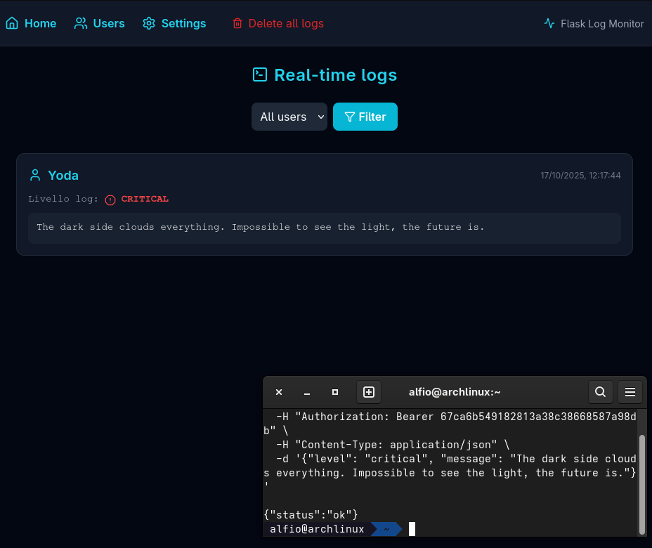
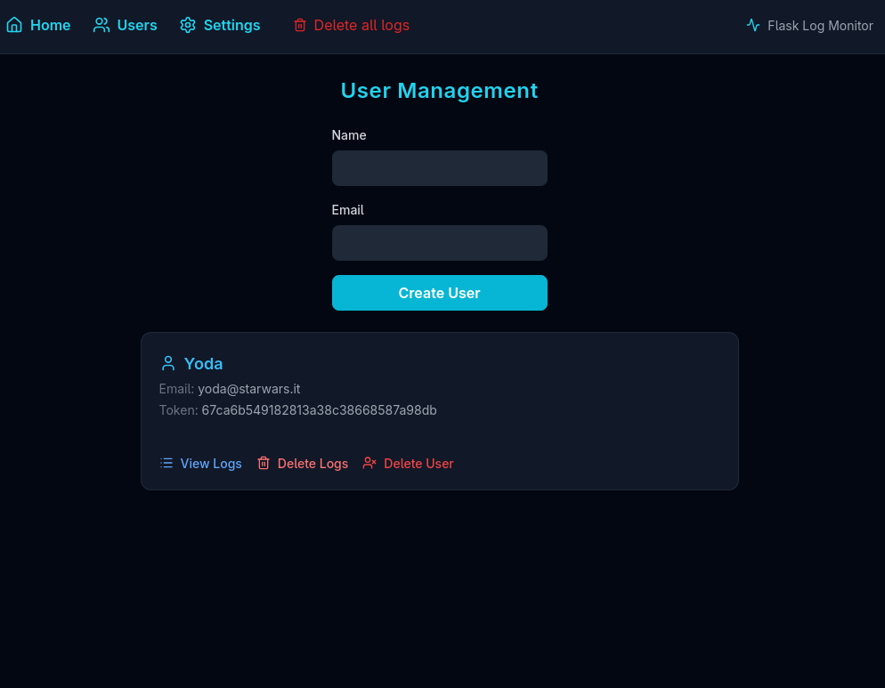
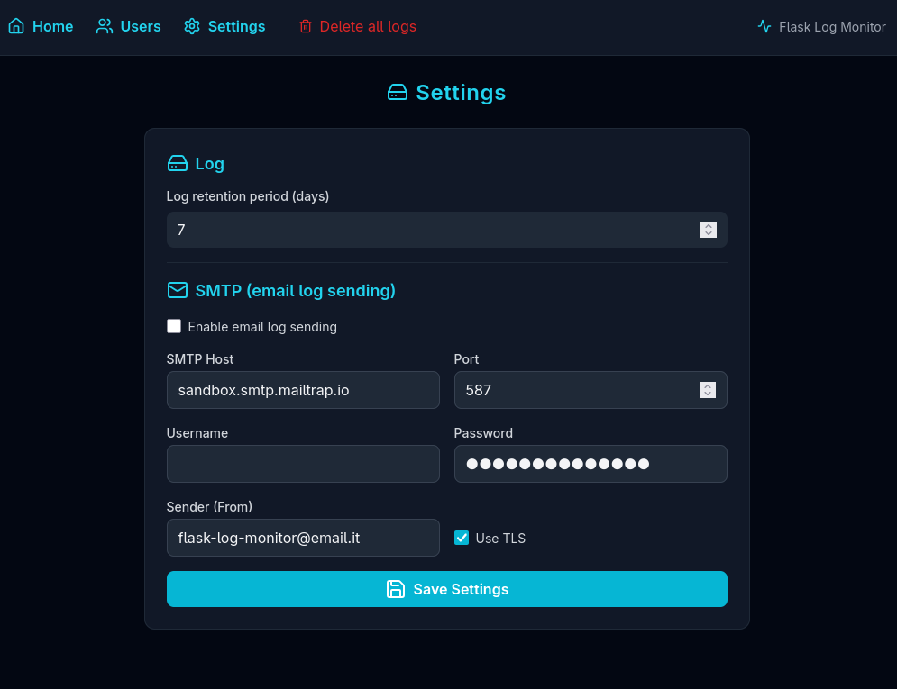
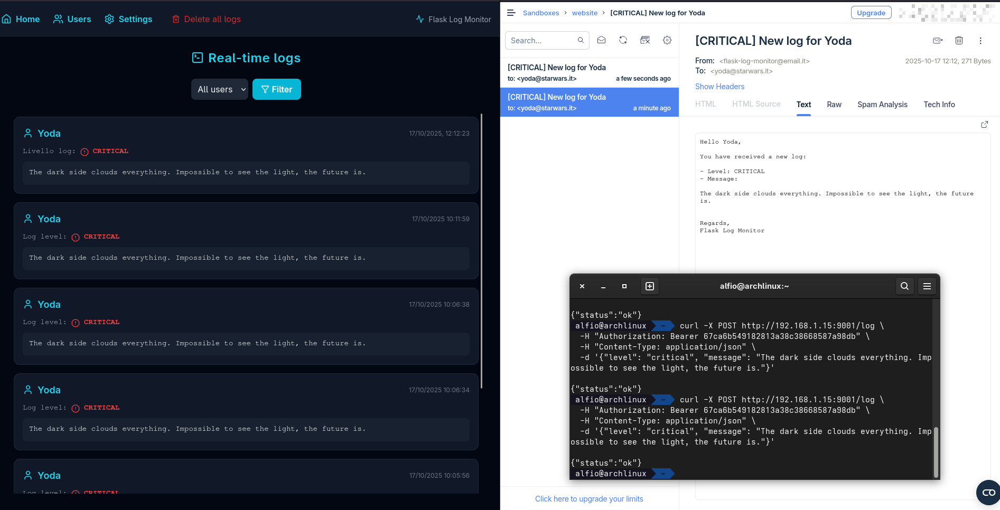

# Flask Log Monitor

**Flask Log Monitor** is a **Python + Flask** web app designed to receive, display, store, and forward logs via email from other applications (for example, **Laravel**).
Each log is saved in a database and displayed live through **WebSocket**, powered by **Flask-SocketIO**.
Each user has their own token and separate logs, with the option to receive notifications by email.

---

## Screenshots

### Homepage


### Manage Users


### Settings


### Send Mail


---

## ⚠️ Security Notice

> The **home page displays all logs from all users without any authentication or protection**.
> For this reason, **Flask Log Monitor is intended exclusively for development, testing, or staging environments** — **not for production use**.
>
> If you plan to deploy it in production, you must implement an **authentication system** or protect it via a **reverse proxy (such as Basic Auth or VPN access)**.

---

## 🚀 Main Features

* Receive logs via authenticated **HTTP POST** (Bearer token)
* Real-time dashboard with **Socket.IO**
* Modern UI using **TailwindCSS + Lucide Icons**
* Multi-user management with unique tokens
* Automatic **email forwarding (SMTP)**
* Encrypted SMTP password stored in `.env`
* Automatic old log cleanup via **daily cron job**
* Native integration with **Laravel Monolog**

---

## ⚙️ Installation (Standalone Mode) for development

### Clone the project

```bash
git clone https://github.com/your-username/flask-log-monitor.git
cd flask-log-monitor
```

### Create a virtual environment

```bash
python3 -m venv env
source env/bin/activate
pip install -r requirements.txt
```

### Configure the `.env` file

```bash
cp .env.example .env
APP_DEBUG=True
```

### Generate ENCRYPTION_KEY= and save in the .env file 

```bash
python -c "from cryptography.fernet import Fernet; print(Fernet.generate_key().decode())"
```

### Run

```bash
python ./app.py
```

---

## 🧑‍💻 Using the Web Interface

### **Home**

Displays all logs (up to the latest 100), filterable by user.
Each log card shows:

* User name (with icon)
* Date and time (UTC+2)
* Log level (info, warning, error, critical)
* Message text

Logs are updated **live** in real time via **Socket.IO**.

---

### 👥 **User Management**

Go to **/users** or click “Users” in the navbar:

* Create a new user by specifying a **name** and **email** → a token is automatically generated.
* You can **view** or **delete** a user (including their logs).
* The email field is optional, but if provided, the user will receive logs via SMTP.

---

### ✉️ **Email Log Forwarding**

If the user has an email address and SMTP is correctly configured:

* Every new log received via API is automatically forwarded to the user.
* SMTP credentials are encrypted in the `.env` file using **Fernet Encryption**.
* You can edit host, port, username, and sender directly from **/settings**.

---

### ⚙️ **Settings**

The `/settings` section allows you to:

* Set log retention days (`LOG_RETENTION_DAYS`)
* Configure SMTP (host, port, user, password, from, TLS)
* Enable or disable email sending (`SMTP_ENABLED`)
* The password is **automatically encrypted** in `.env`

---

### 🧹 **Automatic Cleanup**

A built-in cron job automatically deletes logs older than `LOG_RETENTION_DAYS` every day at **03:00**.
You can also run it manually:

```bash
flask --app app cleanup
```

---

## 🧩 Laravel Integration

The easiest way to connect Laravel with Flask Log Monitor is by using the Composer package
👉 **[alfiosalanitri/laravel-flask-logger](https://github.com/alfiosalanitri/laravel-flask-logger)**

### 1️⃣ Install the package in Laravel

```bash
composer require alfiosalanitri/laravel-flask-logger
```

### 2️⃣ Configure environment variables

```env
LOG_CHANNEL=stack
LOG_STACK=flask,daily
LOG_FLASK_URL=http://localhost:5000
LOG_FLASK_TOKEN=token-generated-from-app
LOG_FLASK_LEVEL=debug
```

That’s it — the package automatically registers the `flask` log channel and integrates seamlessly with Laravel’s logging system.

### 3️⃣ Test it!

```php
Log::info('Hello from Laravel!');
Log::error('Something went wrong!');
```

➡️ You’ll see the messages appear live — and receive an email if configured.

---

## 📡 Send Logs Manually (via `curl`)

```bash
curl -X POST http://localhost:5000/log \
  -H "Authorization: Bearer 1234" \
  -H "Content-Type: application/json" \
  -d '{"level": "warning", "message": "Manual log test via curl"}'
```

---

## 🐳 Docker Compose

Here’s the **English version** of the updated section for your README, clearly explaining how to use the image from GitHub Container Registry and what each part of the configuration does 👇

---

## 🐳 Docker Compose

You can run **Flask Log Monitor** easily with **Docker Compose**, using the public image available on **GitHub Container Registry** or with cloned repository.

### `docker-compose.yml` (ghcr.io/alfiosalanitri/flask-log-monitor:latest)

```bash
cp .env.example .env
```

```yaml
services:
  app:
    image: ghcr.io/alfiosalanitri/flask-log-monitor:latest
    ports:
      - "${APP_PORT:-5000}:${APP_PORT:-5000}"
    env_file:
      - .env
    restart: unless-stopped
    volumes:
      - .env:/app/.env
```

To start the app in the background:

```bash
docker compose up -d
```

### `docker-compose.yml` (Local files)

```yaml
services:
  app:
    build:
      context: .
      args:
        APP_PORT: ${APP_PORT:-5000}
    ports:
      - "${APP_PORT:-5000}:${APP_PORT:-5000}"
    env_file:
      - .env
    restart: unless-stopped
    volumes:
      - .:/app
```

To build and start the app in the background:

```bash
docker compose up -d --build
```

The application will be available at:

```
http://localhost:5000
```

(or on the port defined in `APP_PORT` inside your `.env` file)

---

### 🐋 Run with Docker only (optional)

If you prefer to run the app directly without Docker Compose:

```bash
docker run -d \
  -p 5000:5000 \
  --env-file .env \
  ghcr.io/alfiosalanitri/flask-log-monitor:latest
```

This command pulls the image from GitHub Container Registry and starts Flask Log Monitor on port **5000** with your environment configuration.

---

## 💡 Tips

* You can temporarily disable emails by setting `SMTP_ENABLED=false`
* Generate the encryption key once:

  ```bash
  python -c "from cryptography.fernet import Fernet; print(Fernet.generate_key().decode())"
  ```
* Passwords updated from the web interface are **automatically encrypted**
* New logs appear live and remain visible until manually deleted

---

## 🔒 Secure Deployment (Optional)

If you plan to expose Flask Log Monitor on a public server:

1. Protect access using **Basic Auth** (e.g., via Nginx reverse proxy)

   ```nginx
   auth_basic "Restricted Access";
   auth_basic_user_file /etc/nginx/.htpasswd;
   ```

2. Or restrict access to a **VPN network** (e.g., WireGuard or Tailscale)

3. Always serve via **HTTPS** and disable direct public access to port `5000`.

These simple steps ensure that sensitive log data is not exposed publicly.

---

## 📄 License

This project is licensed under the MIT License. See [LICENSE](LICENSE) for details. 📜